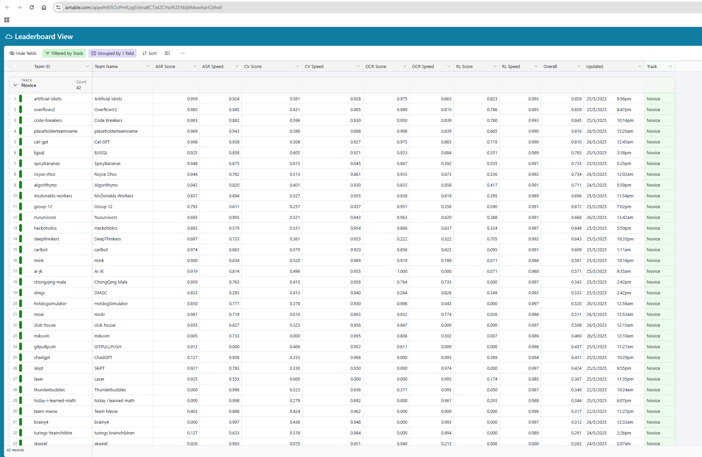

# 🏆 DSTA BRAINHACK 2025 TIL-AI 🚀

Welcome to our Team Artificial Idiots's repository for **DSTA Brainhack TIL-AI 2025**! This project showcases our collective effort in tackling a diverse set of AI and machine learning problems—from audio processing and computer vision to reinforcement learning and optimization in the hackathon.

We are proud to present our **innovative solutions** and the **cutting-edge models** we implemented.

📄 **Challenge Requirements:**
You can find the detailed specifications for each challenge [here on the official wiki](https://github.com/til-ai/til-25/wiki/Challenge-specifications).

  
   
  <em>DSTA Brainhack Finalist Badge</em>

## 🏅 Competition Achievement

🎉 After a tough and gruelling fight, we are proud to have placed under the **Top 8** teams at **TIL-AI 2025**!

  
   
  <em>As the 1st ranked team in the online qualifiers, we secured our spot in the main event.</em>

## 👥 Our Team

This project was a collaborative effort by a dedicated and passionate team of students from the National University of Singapore (NUS):

- Spencer Chu
- Lim Jia Tzer
- Tan Jia Jun
- Gabriel Koh
- Joven Ong

## 🛠️ Technical Deep Dive

Below is a breakdown of the challenges we tackled and the technical methodologies we employed.

### 1. 🎤 Automatic Speech Recognition (ASR)

**Challenge:** Develop a high-accuracy, low-latency transcription system for real-time audio.

**Our Approach:**
We engineered a robust pipeline centered on state-of-the-art models, aggressive optimization, and meticulous fine-tuning.

*   **Model Distillation and Selection:** We employed a dual-model strategy. Our primary model, [`nvidia/parakeet-tdt-0.6b-v2`](https://huggingface.co/nvidia/parakeet-tdt-0.6b-v2), was chosen for its excellent base performance. To further enhance speed, we utilized [`distil-whisper/distil-large-v3.5`](https://huggingface.co/distil-whisper/distil-large-v3.5), a distilled version of Whisper, which reduces model size and computational load without a significant drop in accuracy. This strategy of knowledge distillation was key to achieving our speed targets.

*   **Inference Optimization:** To maximize throughput, we integrated **Flash Attention v2**, a memory-efficient attention mechanism that avoids materializing the large N x N attention matrix. This, combined with the `BetterTransformer` library, allowed us to replace standard attention modules with optimized versions, significantly speeding up inference on GPU.

*   **Extensive Fine-Tuning:** We didn't just use the pre-trained models. We performed extensive fine-tuning on both the **transformer backbone** and the **language model head**. This involved using a custom dataset tailored to the competition's audio characteristics, allowing the models to adapt to specific accents, terminologies, and acoustic environments.

**Final Score**
- Accuracy: 0.972
- Speed: 0.932

### 2. 👁️ Computer Vision (CV)

**Challenge:** Detect specific objects in images with maximum speed and precision.

**Our Approach:**
Our solution focused on adapting a powerful object detection model and applying advanced optimization techniques for deployment.

*   **Model Adaptation:** We selected **YOLOv8** for its state-of-the-art balance of speed and accuracy. The core of our work involved adapting this model by fine-tuning it on a custom-annotated dataset specific to the challenge objects. This ensured the model's feature extractors were highly specialized for the task.

*   **Advanced Optimization Pipeline:** A standard PyTorch model was too slow for the competition's strict latency requirements. Our optimization workflow was:
    1.  **Model Pruning & Quantization:** We first experimented with pruning unnecessary weights from the trained model.
    2.  **TensorRT Conversion:** The PyTorch model was converted to a TensorRT `.engine` file. This process performs graph optimizations, layer fusions, and selects hardware-specific kernels.
    3.  **Precision Calibration:** We utilized **FP16 precision**, which cuts memory usage in half and leverages GPU Tensor Cores for a significant speedup with minimal impact on accuracy. We calibrated the model to determine the optimal layers to run in lower precision.

This pipeline resulted in a substantial reduction in latency and an increase in throughput, crucial for achieving a high speed score.

**Final Score**
- Accuracy: 0.598
- Speed: 0.933

### 3. 📄 Optical Character Recognition (OCR)

**Challenge:** Extract text from documents with diverse and complex layouts.

**Our Approach:**
We chose a transformer-based model and implemented robust pre- and post-processing pipelines to handle noisy and complex images.

*   **Model Architecture:** We used [`stepfun-ai/GOT-OCR-2.0-hf`](https://huggingface.co/stepfun-ai/GOT-OCR-2.0-hf), which is based on a **Generative Pre-trained Transformer (GPT)** architecture. Unlike traditional OCR, it treats text extraction as a sequence generation task, making it highly effective for unstructured layouts.

*   **Image Pre-processing:** Before feeding images to the model, we implemented several pre-processing steps:
    *   **Deskewing:** Correcting the orientation of rotated documents.
    *   **Binarization:** Converting the image to black and white to enhance character-background contrast.
    *   **Noise Removal:** Applying filters to remove artifacts from scanning.

*   **Post-processing and Validation:** The raw output from the model was refined using a post-processing script that corrected common OCR errors using rule-based logic and dictionary lookups. This step was critical for pushing our accuracy score to near-perfect levels.

**Final Score**
- Accuracy: 0.975
- Speed: 0.867

### 4. 🤖 Reinforcement Learning

**Challenge:** Design an autonomous agent to navigate a hostile, multi-agent environment.

**Our Approach:**
We treated this as a **Multi-Agent Reinforcement Learning (MARL)** problem, developing a hybrid system that combined deep learning with classic search algorithms for optimal performance.

*   **Agent Architecture:**
    *   **Scout (Ego-Agent):** A **Deep Q-Network (DQN)** agent with a **CNN** frontend. The CNN processed the 2D grid environment, extracting spatial features like guard positions and obstacles.
    *   **Guards (Enemy Agents):** Modeled as heuristic agents following a Finite State Machine (FSM).

*   **Pathfinding & Navigation:** We pre-calculated a graph of the environment and used **Dijkstra's Algorithm** to find the shortest path between any two points. For dynamic pathfinding, our agent could employ **A\* Search**, which uses a heuristic to guide the search, making it faster than Dijkstra's for single-target pathing.

*   **Reward Engineering:** The key to training our DQN agent was a carefully designed reward function:
    *   **Positive Rewards:** Reaching the goal, discovering new areas.
    *   **Negative Rewards:** Getting caught by a guard, staying idle for too long.
    *   **Shaped Rewards:** Small positive rewards for moving closer to the goal and negative rewards for moving away, providing a dense signal for faster learning.

*   **Hybrid Control System:** A purely learned policy can be unpredictable. We implemented a layered architecture where a heuristic "Evasion Layer" would override the DQN's actions if a guard came within a critical threshold, guaranteeing survival.

**Final Score**
- Accuracy: 0.823
- Speed: 0.993

### 5. 🧩 Surprise Challenge: Document Reassembly

**Challenge:** Reconstruct a shredded document from a set of vertical strips.

**Our Approach:**
We framed this as a graph theory problem, finding the optimal ordering of strips by modeling it as the **Traveling Salesperson Problem (TSP)**.

*   **Similarity Metric:** To determine the "cost" of placing one strip next to another, we calculated the dissimilarity between their adjacent edges. While Sum of Squared Differences (SSD) is a viable metric, we used **Normalized Cross-Correlation (NCC)**. NCC is more robust to variations in brightness and contrast between strips, providing a more reliable similarity score.

*   **Cost Matrix Generation:** We computed an N x N cost matrix where `cost[i][j]` represented the dissimilarity score between the right edge of strip `i` and the left edge of strip `j`.

*   **Heuristic Search:** Instead of an exhaustive TSP solver, which can be slow, we implemented a **Beam Search** algorithm. At each step, we kept the top-k most promising partial sequences (beams) and extended them. This heuristic approach allowed us to find a near-optimal solution within the strict time limits of the challenge.

**Final Score**
- Accuracy: 0.985
- Speed: 0.978

### 6. 📦 Server & Deployment

**Challenge:** Package all models into a robust, deployable, and efficient offline system.

*   **Containerization:** We used **Docker** to orchestrate our entire application. Each component (ASR, CV, etc.) was containerized independently. This ensured that dependencies were isolated and the system was easily reproducible. We used **multi-stage builds** in our Dockerfiles to create lightweight production images by excluding build-time dependencies.

*   **API & Orchestration:** A central **FastAPI** server acted as the main entry point. It was responsible for receiving requests, routing them to the appropriate model container, and aggregating the results. This microservices-style architecture allowed us to manage each component independently.

*   **Offline First & Optimization:** The entire system was designed to run offline. All models and dependencies were included in the Docker images. We applied inference optimization techniques not just at the model level (TensorRT) but also at the server level, using asynchronous workers to handle multiple requests concurrently without blocking.

## 🧠 Reflections & Key Learnings

This hackathon was an intense and rewarding experience that bridged the gap between theoretical knowledge and practical, industry-relevant skills.

**AI Engineering Key Competencies:**
*   **Models are only half the story:** The best model is useless if it's too slow. We learned that optimization techniques like **quantization (TensorRT), Flash Attention, and model distillation** are not just "nice-to-haves"—they are essential for building practical AI systems.
*   **The power of fine-tuning:** Pre-trained models are a great starting point, but achieving state-of-the-art performance requires meticulous **fine-tuning** on domain-specific data. Data quality and augmentation are as important as the model architecture itself.
*   **Hybrid systems are often superior:** Combining deep learning models (DQN) with classical algorithms (A*, FSMs) can create robust and reliable systems. Don't be afraid to use heuristics to constrain the model's action space and prevent catastrophic failures.

**Software Engineering Key Competencies:**
*   **MLOps is crucial:** Our success depended heavily on our ability to quickly package, deploy, and version our models. Skills in **Docker, container orchestration, and API design (FastAPI)** are critical for managing the complexity of modern AI applications.
*   **Design for failure:** In a high-pressure environment, things will break. Building independent, containerized services meant that a failure in one component (e.g., ASR) didn't bring down the entire system.
*   **Performance is a feature:** Writing clean code is important, but writing *performant* code is critical. Understanding how to leverage tools like asynchronous programming and build lightweight containers can make a huge difference in the final product.

## 🙌 Thank You!

Thank you for visiting our repository! We hope our work offers inspiration and valuable insights into solving complex AI challenges.

Feel free to ⭐ star, 🍴 fork, or reach out if you're interested in learning more or collaborating
